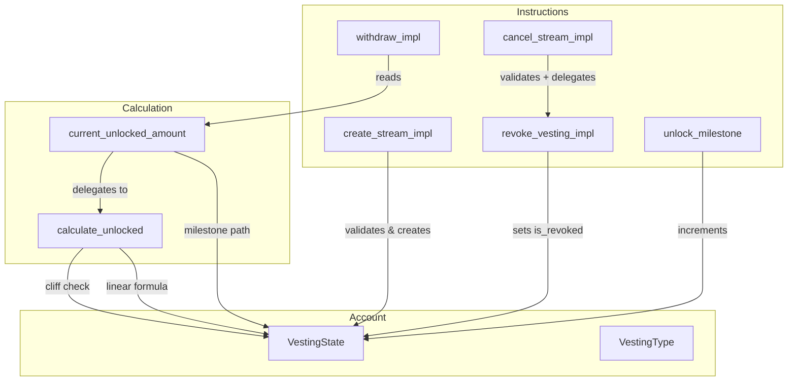

# Design Document: Advanced Vesting

## Overview

This feature extends the Vestalink Anchor program to support three new capabilities: cliff vesting, milestone-based vesting, and an improved cancel_stream instruction. The existing contract already defines `VestingType::Cliff` and `VestingType::Milestone` enum variants, and the `VestingState` account already contains `cliff_time`, `milestone_count`, `milestones_reached`, and `authority_milestone` fields — but they are either stubbed out or ignored. This design activates those dormant code paths and adds a cancellation instruction with clearer error semantics.

The core design principle is **minimal structural change**: we leverage existing account fields, extend existing functions rather than replacing them, and preserve all existing instruction signatures and behaviors.

## Architecture



The architecture adds three code paths to the existing single-file structure:

1. **Cliff path**: `calculate_unlocked` gains a `vesting_type` and `cliff_time` parameter. When `VestingType::Cliff` and `current_time <= cliff_time`, it returns 0. Otherwise, it falls through to the existing linear formula.
2. **Milestone path**: `current_unlocked_amount` gains a branch for `VestingType::Milestone` that computes `total_amount * milestones_reached / milestone_count`.
3. **Cancel path**: A new `cancel_stream_impl` function validates preconditions (not already cancelled, not fully vested), then delegates to the existing `revoke_vesting_impl` for the actual token transfers and state updates.

## Components and Interfaces

### 1. Vesting Calculator (`calculate_unlocked` extension)

The existing `calculate_unlocked` function is extended to handle all vesting types:

```rust
pub fn calculate_unlocked(
    total_amount: u64,
    start_time: i64,
    end_time: i64,
    current_time: i64,
    vesting_type: &VestingType,
    cliff_time: i64,
    milestone_count: u8,
    milestones_reached: u8,
) -> u64
```

**Behavior by vesting type:**

| VestingType | Condition | Result |
|---|---|---|
| `Linear` | (existing) | Linear formula: `total_amount * elapsed / duration` |
| `Cliff` | `current_time <= cliff_time` | `0` |
| `Cliff` | `current_time > cliff_time` | Linear formula from `start_time` to `end_time` |
| `Milestone` | (any) | `total_amount * milestones_reached / milestone_count` |

For `Milestone`, the `start_time` and `end_time` fields are still required (for validation: `start_time < end_time`) but do not affect the unlock calculation. Time-based unlocking is entirely replaced by milestone triggers.

### 2. Stream Creator (`create_stream_impl` extension)

The existing `create_stream_impl` is extended to accept `Cliff` and `Milestone` vesting types with type-specific validation:

**Validation rules (in order):**

| # | Condition | Error |
|---|---|---|
| 1 | `total_amount == 0` | `InvalidAmount` (6001) |
| 2 | `start_time >= end_time` | `InvalidTimeRange` (6000) |
| 3 | `vesting_type == Cliff && cliff_time > end_time` | `CliffTimeExceedsEndTime` (6011) |
| 4 | `vesting_type == Milestone && milestone_count == 0` | `MilestoneCountZero` (6012) |

For `Cliff` streams, `cliff_time` is now stored as provided (not overwritten to `start_time`). When `cliff_time == start_time`, the stream behaves identically to `Linear`.

For `Milestone` streams, `milestone_count` is stored as provided. `milestones_reached` starts at `0`.

### 3. Milestone Manager (`unlock_milestone` implementation)

The existing `unlock_milestone` stub is replaced with a working implementation:

```rust
pub fn unlock_milestone(ctx: Context<UnlockMilestone>) -> Result<()> {
    let vesting_state = &mut ctx.accounts.vesting_state;

    if vesting_state.vesting_type != VestingType::Milestone {
        return err!(VestingError::UnsupportedVestingType);
    }
    if vesting_state.milestones_reached >= vesting_state.milestone_count {
        return err!(VestingError::AllMilestonesReached);
    }
    if vesting_state.is_revoked {
        return err!(VestingError::StreamCancelled);
    }

    vesting_state.milestones_reached += 1;
    Ok(())
}
```

**Validation:**
- `vesting_type` must be `Milestone` → else `UnsupportedVestingType` (6002)
- `milestones_reached` must be less than `milestone_count` → else `AllMilestonesReached` (6013)
- Stream must not be revoked → else `StreamCancelled` (6014)

The `UnlockMilestone` accounts struct already enforces `has_one = authority_milestone`, so only the designated milestone authority can call this instruction.

### 4. Stream Canceller (`cancel_stream_impl`)

A new `cancel_stream_impl` function adds preconditions before delegating to the existing `revoke_vesting_impl`:

```rust
pub fn cancel_stream_impl(ctx: Context<RevokeVesting>) -> Result<()> {
    let vesting_state = &ctx.accounts.vesting_state;

    if vesting_state.is_revoked {
        return err!(VestingError::StreamCancelled);
    }

    let current_time = Clock::get()?.unix_timestamp;
    let unlocked = calculate_unlocked(
        vesting_state.total_amount,
        vesting_state.start_time,
        vesting_state.end_time,
        current_time,
        &vesting_state.vesting_type,
        vesting_state.cliff_time,
        vesting_state.milestone_count,
        vesting_state.milestones_reached,
    );

    if unlocked >= vesting_state.total_amount {
        return err!(VestingError::StreamFullyVested);
    }

    revoke_vesting_impl(ctx)
}
```

**Key design decision**: `cancel_stream_impl` delegates to `revoke_vesting_impl` for the actual token transfers and state mutations. This avoids duplicating the transfer logic. The new function only adds two precondition checks:

1. Stream is not already cancelled → `StreamCancelled` (6014)
2. Stream is not fully vested → `StreamFullyVested` (6015)

The existing `revoke_vesting` and `cancel_vesting` instructions continue to call `revoke_vesting_impl` directly, preserving their current behavior (they allow revoking a fully-vested stream and use error code 6005 for double-revoke).

### 5. Current Unlocked Amount (`current_unlocked_amount` extension)

The existing `current_unlocked_amount` function is extended to handle all vesting types:

```rust
fn current_unlocked_amount(vesting_state: &VestingState) -> Result<u64> {
    if vesting_state.is_revoked {
        return Ok(vesting_state.vested_amount_at_revocation);
    }

    let current_time = Clock::get()?.unix_timestamp;

    match vesting_state.vesting_type {
        VestingType::Milestone => {
            if vesting_state.milestone_count == 0 {
                return Ok(0);
            }
            Ok(vesting_state.total_amount
                .checked_mul(vesting_state.milestones_reached as u64)
                .ok_or(VestingError::ArithmeticOverflow)?
                .checked_div(vesting_state.milestone_count as u64)
                .ok_or(VestingError::ArithmeticOverflow)?)
        }
        _ => Ok(calculate_unlocked(
            vesting_state.total_amount,
            vesting_state.start_time,
            vesting_state.end_time,
            current_time,
            &vesting_state.vesting_type,
            vesting_state.cliff_time,
            vesting_state.milestone_count,
            vesting_state.milestones_reached,
        )),
    }
}
```

For `Milestone` streams, the calculation is purely based on `milestones_reached / milestone_count` — no time component. For `Linear` and `Cliff`, the existing `calculate_unlocked` function handles the logic.

## Data Models

### VestingState (unchanged structure)

The existing `VestingState` account requires **no structural changes**. All fields needed for cliff and milestone vesting already exist:

| Field | Current Usage | New Usage |
|---|---|---|
| `cliff_time` | Always set to `start_time` | Set to actual cliff date for `Cliff` type |
| `milestone_count` | Always `0` | Set to actual count for `Milestone` type |
| `milestones_reached` | Always `0` | Incremented by `unlock_milestone` |
| `authority_milestone` | Set to `funder` | Remains `funder` (configurable by stream creator) |
| `vesting_type` | Only `Linear` accepted | `Cliff` and `Milestone` now accepted |

The `VestingState::SIZE` constant of 256 bytes remains sufficient.

### VestingType Enum (unchanged)

```rust
pub enum VestingType {
    Cliff,      // variant 0
    Linear,     // variant 1
    Milestone,  // variant 2
}
```

No changes to the enum. The serialization format is identical.

### CreateVestingParams (unchanged)

```rust
pub struct CreateVestingParams {
    pub total_amount: u64,
    pub vesting_type: VestingType,
    pub start_time: i64,
    pub end_time: i64,
    pub cliff_time: i64,
    pub milestone_count: u8,
    pub nonce: u64,
}
```

No changes. The `cliff_time` and `milestone_count` fields are now properly used instead of being overwritten.

### VestingError (extended)

New error codes starting from 6011:

| Code | Variant | Message |
|---|---|---|
| 6011 | `CliffTimeExceedsEndTime` | "Cliff time must not exceed end time" |
| 6012 | `MilestoneCountZero` | "Milestone count must be greater than zero" |
| 6013 | `AllMilestonesReached` | "All milestones have already been reached" |
| 6014 | `StreamCancelled` | "Stream has already been cancelled" |
| 6015 | `StreamFullyVested` | "Stream is fully vested and cannot be cancelled" |
| 6016 | `StreamExpired` | "Stream has expired" |

### Instruction Accounts (unchanged)

All existing account structs (`CreateVestingSchedule`, `Withdraw`, `RevokeVesting`, `UnlockMilestone`) remain unchanged. The `cancel_stream` instruction reuses the `RevokeVesting` accounts struct since it performs the same operations with additional preconditions.

## Correctness Properties

*A property is a characteristic or behavior that should hold true across all valid executions of a system — essentially, a formal statement about what the system should do. Properties serve as the bridge between human-readable specifications and machine-verifiable correctness guarantees.*

Property 1: Cliff gates withdrawals
*For any* cliff stream with `cliff_time > start_time`, the unlocked amount at any time before or equal to `cliff_time` SHALL be zero
**Validates: Requirements 1.2**

Property 2: Cliff falls through to linear
*For any* cliff stream with `cliff_time > start_time`, the unlocked amount at any time after `cliff_time` SHALL equal the linear vesting formula result from `start_time` to `end_time`
**Validates: Requirements 1.3**

Property 3: Cliff equal to start is linear (edge case of Property 2)
*For any* cliff stream where `cliff_time == start_time`, the unlocked amount at any time SHALL equal the linear vesting formula result
**Validates: Requirements 1.4**

Property 4: Milestone unlock is proportional
*For any* milestone stream with `milestone_count > 0` and `milestones_reached <= milestone_count`, the unlocked amount SHALL equal `total_amount * milestones_reached / milestone_count` using floor division. When `milestones_reached == milestone_count`, this yields `total_amount`.
**Validates: Requirements 2.4, 2.5**

Property 5: Cancel distributes correctly
*For any* active stream that is cancelled, the recipient SHALL be able to withdraw exactly the amount that was vested at the time of cancellation, and the funder SHALL receive back exactly the unvested portion
**Validates: Requirements 3.1, 3.5**

Property 6: Cancel rejects fully vested
*For any* stream where the unlocked amount equals `total_amount`, calling `cancel_stream` SHALL fail with error code 6015
**Validates: Requirements 3.3**

Property 7: Cancel rejects already cancelled
*For any* stream where `is_revoked == true`, calling `cancel_stream` SHALL fail with error code 6014
**Validates: Requirements 3.2**

Property 8: Linear vesting unchanged
*For any* linear stream, the unlocked amount at any time SHALL equal the existing linear formula result: `total_amount * (current_time - start_time) / (end_time - start_time)`
**Validates: Requirements 5.1**

Property 9: Revoke behavior unchanged
*For any* call to `revoke_vesting` or `cancel_vesting`, the behavior SHALL be identical to the current implementation (no new preconditions, same error codes)
**Validates: Requirements 5.2**

## Error Handling

### New Error Codes

| Code | Variant | Trigger |
|---|---|---|
| 6011 | `CliffTimeExceedsEndTime` | Creating a cliff stream where `cliff_time > end_time` |
| 6012 | `MilestoneCountZero` | Creating a milestone stream where `milestone_count == 0` |
| 6013 | `AllMilestonesReached` | Calling `unlock_milestone` when `milestones_reached == milestone_count` |
| 6014 | `StreamCancelled` | Calling `cancel_stream` on an already-cancelled stream |
| 6015 | `StreamFullyVested` | Calling `cancel_stream` on a fully-vested stream |
| 6016 | `StreamExpired` | Reserved for future use (stream past end time with no remaining balance) |

### Error Handling Strategy

1. **Validation order**: Errors are checked in a consistent order: amount validation → time range validation → vesting-type-specific validation → authorization checks. This ensures deterministic error codes for any given invalid input.

2. **Re-use of existing errors**: The `UnsupportedVestingType` (6002) error is re-used for `unlock_milestone` calls on non-Milestone streams. The `UnauthorizedClaimant` (6003) error is re-used for unauthorized `cancel_stream` calls (enforced by Anchor's `has_one` constraint on `authority_revoker`).

3. **Separation of cancel vs revoke**: `cancel_stream` uses new error codes (6014, 6015) while `revoke_vesting`/`cancel_vesting` continue using the existing `StreamRevoked` (6005) error. This preserves backward compatibility.

4. **Arithmetic safety**: All milestone calculations use `checked_mul` and `checked_div` to prevent overflow. Division by zero is prevented by the `milestone_count == 0` validation at stream creation time.

## Testing Strategy

### Unit Tests (Rust)

Unit tests for `calculate_unlocked` are extended to cover all vesting types:

- **Cliff tests**: Zero before cliff, linear after cliff, cliff equal to start time, cliff at end time
- **Milestone tests**: Zero milestones reached, partial milestones, all milestones reached, floor division
- **Linear regression**: Existing linear tests must continue to pass unchanged

### Integration Tests (TypeScript)

Integration tests cover end-to-end flows:

- **Cliff vesting**: Create cliff stream, attempt withdrawal before cliff (fails), withdraw after cliff (succeeds), cliff equal to start (behaves like linear)
- **Milestone vesting**: Create milestone stream, trigger milestones, withdraw after each milestone, attempt extra milestone trigger (fails)
- **Cancel stream**: Cancel before cliff, cancel mid-stream, cancel after full vest (fails), cancel already-cancelled (fails), cancel by non-authority (fails)
- **Error cases**: All new error codes (6011-6016) tested with specific scenarios
- **Regression**: All 13 existing integration tests must pass without modification

### Property-Based Tests

Property tests validate universal properties using randomized inputs:

- **Property 1**: Cliff gates withdrawals — for any cliff stream, unlocked amount is zero before cliff_time
- **Property 2**: Cliff falls through to linear — for any cliff stream after cliff_time, unlocked amount matches linear formula
- **Property 3**: Milestone unlock is proportional — for any milestone stream, unlocked amount equals `total_amount * milestones_reached / milestone_count`
- **Property 4**: Cancel distributes correctly — for any cancelled stream, recipient can withdraw exactly the vested amount
- **Property 5**: Linear vesting unchanged — for any linear stream, unlocked amount matches existing formula

Property tests use a minimum of 100 iterations per property with randomized `total_amount`, `start_time`, `end_time`, `cliff_time`, `milestone_count`, and `milestones_reached` values within valid ranges.