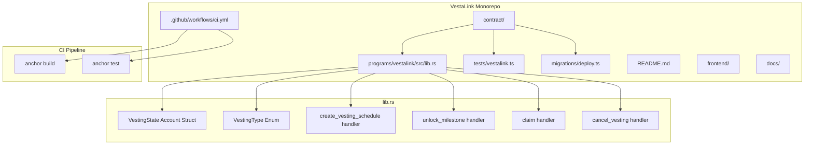

# Design Document

## Overview

The VestaLink scaffold establishes the foundational Anchor project for a Solana token distribution protocol. It delivers a compiling program with empty instruction handlers, account structs matching the Week 2 architecture, a README, a CI pipeline, and a basic passing test. This is a setup-only phase — no business logic is implemented.

The scaffold targets two developers who will build on this foundation in parallel starting Week 4. The project uses a monorepo structure with `contract/` for the Anchor program and `frontend/` (coming soon) for the Next.js app.

## Architecture



### Project Structure

```
vestalink/
├── .github/
│   └── workflows/
│       └── ci.yml
├── contract/                    # Anchor (Solana) program
│   ├── programs/
│   │   └── vestalink/
│   │       └── src/
│   │           └── lib.rs
│   ├── tests/
│   │   └── vestalink.ts
│   ├── migrations/
│   │   └── deploy.ts
│   ├── target/
│   │   ├── deploy/              # Compiled .so binaries and keypairs
│   │   ├── idl/                 # Generated IDL JSON
│   │   └── types/               # Generated TypeScript types
│   ├── Anchor.toml
│   ├── Cargo.toml
│   ├── package.json
│   ├── tsconfig.json
│   └── rust-toolchain.toml
├── frontend/                    # Next.js app (coming soon)
├── docs/                        # Research and architecture documents
├── raw_docs/                    # Original research PDFs
├── .kiro/specs/                 # Spec files
└── README.md
```

### Key Decisions

1. **Single program**: One Anchor program (`vestalink`) — no multi-program setup needed for scaffold
2. **Empty handlers**: Instruction handlers accept parameters and accounts but perform no state mutations beyond what Anchor requires for account initialization
3. **VestingType as Rust enum**: Defined as an Anchor enum with `Cliff`, `Linear`, and `Milestone` variants, serialized via Anchor's `#[derive(AnchorSerialize, AnchorDeserialize)]`
4. **VestingState as PDA**: Each recipient gets their own deterministic VestingState account, seeded by recipient pubkey

## Components and Interfaces

### VestingType Enum

```rust
#[derive(AnchorSerialize, AnchorDeserialize, Clone, PartialEq, Eq, Debug)]
pub enum VestingType {
    Cliff,
    Linear,
    Milestone,
}
```

### VestingState Account

```rust
#[account]
pub struct VestingState {
    pub recipient: Pubkey,
    pub funder: Pubkey,
    pub total_amount: u64,
    pub claimed_amount: u64,
    pub authority_revoker: Pubkey,
    pub authority_milestone: Pubkey,
    pub treasury_return_address: Pubkey,
    pub vesting_type: VestingType,
    pub is_revoked: bool,
    pub start_time: i64,
    pub end_time: i64,
    pub cliff_time: i64,
    pub milestone_count: u8,
    pub milestones_reached: u8,
}
```

Account size calculation: 8 (discriminator) + 32×5 (Pubkeys) + 8×2 (u64s) + 1+1 (enum max variant) + 1 (bool) + 8×3 (i64s) + 1×2 (u8s) = 8 + 160 + 16 + 2 + 1 + 24 + 2 = **213 bytes**. Anchor rounds to 8-byte alignment, so the allocated space will be **216 bytes**.

### Instruction Handlers

Each handler defines its required accounts and parameters but contains no business logic beyond a placeholder `msg!` statement.

#### create_vesting_schedule

```rust
pub fn create_vesting_schedule(ctx: Context<CreateVestingSchedule>, params: CreateVestingParams) -> Result<()> {
    msg!("create_vesting_schedule: scaffold placeholder");
    Ok(())
}
```

**Accounts (CreateVestingSchedule):**

- `vesting_state` (signer, PDA init) — the new VestingState account
- `funder` (signer) — the token funder
- `funder_token_account` (ATA) — funder's SPL token account
- `vesting_token_account` (ATA) — PDA-owned token vault
- `token_program` — SPL Token Program
- `system_program` — System Program

**Parameters (CreateVestingParams):**

- `total_amount: u64`
- `vesting_type: VestingType`
- `start_time: i64`
- `end_time: i64`
- `cliff_time: i64`
- `milestone_count: u8`

#### unlock_milestone

```rust
pub fn unlock_milestone(ctx: Context<UnlockMilestone>) -> Result<()> {
    msg!("unlock_milestone: scaffold placeholder");
    Ok(())
}
```

**Accounts (UnlockMilestone):**

- `vesting_state` (mutable) — the VestingState account
- `authority_milestone` (signer) — milestone authority

#### claim

```rust
pub fn claim(ctx: Context<Claim>) -> Result<()> {
    msg!("claim: scaffold placeholder");
    Ok(())
}
```

**Accounts (Claim):**

- `vesting_state` — the VestingState account
- `recipient` (signer) — the claimer
- `recipient_token_account` (ATA) — recipient's SPL token account
- `vesting_token_account` (ATA) — PDA-owned token vault
- `token_program` — SPL Token Program

#### cancel_vesting

```rust
pub fn cancel_vesting(ctx: Context<CancelVesting>) -> Result<()> {
    msg!("cancel_vesting: scaffold placeholder");
    Ok(())
}
```

**Accounts (CancelVesting):**

- `vesting_state` (mutable) — the VestingState account
- `authority_revoker` (signer) — revocation authority
- `treasury_return_address` (ATA) — destination for unvested tokens
- `vesting_token_account` (ATA) — PDA-owned token vault
- `token_program` — SPL Token Program

### Test File

```typescript
// contract/tests/vestalink.ts
import * as anchor from "@coral-xyz/anchor";
import { Program } from "@coral-xyz/anchor";
import { Vestalink } from "../target/types/vestalink";
import { assert } from "chai";
import {
  TOKEN_PROGRAM_ID,
  createMint,
  getOrCreateAssociatedTokenAccount,
  mintTo,
  getAssociatedTokenAddressSync,
  createAssociatedTokenAccountInstruction,
  ASSOCIATED_TOKEN_PROGRAM_ID,
} from "@solana/spl-token";
import idlJson from "../target/idl/vestalink.json";

describe("vestalink", () => {
  const provider = anchor.AnchorProvider.env();
  anchor.setProvider(provider);
  const program = anchor.workspace.vestalink as Program<Vestalink>;
  const wallet = provider.wallet as anchor.Wallet;

  // ... shared state variables ...

  it("deploys successfully", async () => {
    const programId = program.programId;
    assert.isNotNull(programId);
    assert.isTrue(programId.toBase58().length > 0);
  });

  // ... instruction handler tests (create_vesting_schedule, IDL verification) ...

  // ... VestingState struct completeness test ...
});
```

### CI Pipeline

```yaml
name: CI

on:
  push:
    branches: [main]
  pull_request:
    branches: [main]

jobs:
  build-and-test:
    runs-on: ubuntu-latest
    defaults:
      run:
        working-directory: contract
    steps:
      - uses: actions/checkout@v4

      - name: Setup Node.js
        uses: actions/setup-node@v4
        with:
          node-version: "20"

      - name: Install Rust toolchain
        uses: dtolnay/rust-toolchain@stable
        with:
          components: clippy

      - name: Setup Solana CLI
        uses: solana-actions/setup-solana@v1

      - name: Setup Anchor CLI
        uses: metadaoproject/setup-anchor@v1

      - name: Install dependencies
        run: yarn install --frozen-lockfile

      - name: Build Anchor program
        run: anchor build

      - name: Run tests
        run: anchor test
```

## Data Models

### VestingState

| Field                   | Type        | Description                                              |
| ----------------------- | ----------- | -------------------------------------------------------- |
| recipient               | Pubkey      | Wallet address of the token recipient                    |
| funder                  | Pubkey      | Wallet address that funded the vesting schedule          |
| total_amount            | u64         | Total token amount to be distributed                     |
| claimed_amount          | u64         | Amount already claimed by recipient                      |
| authority_revoker       | Pubkey      | Authority that can revoke the vesting schedule           |
| authority_milestone     | Pubkey      | Authority that can unlock milestones                     |
| treasury_return_address | Pubkey      | Address where unvested tokens are returned on revocation |
| vesting_type            | VestingType | Enum: Cliff, Linear, or Milestone                        |
| is_revoked              | bool        | Whether the vesting schedule has been revoked            |
| start_time              | i64         | Unix timestamp when vesting begins                       |
| end_time                | i64         | Unix timestamp when vesting ends                         |
| cliff_time              | i64         | Unix timestamp for cliff unlock                          |
| milestone_count         | u8          | Total number of milestones (for Milestone type)          |
| milestones_reached      | u8          | Number of milestones unlocked so far                     |

### VestingType Enum

| Variant   | Description                                |
| --------- | ------------------------------------------ |
| Cliff     | Tokens unlock at a single cliff timestamp  |
| Linear    | Tokens unlock continuously over time       |
| Milestone | Tokens unlock at discrete milestone points |

### CreateVestingParams

| Field           | Type        | Description              |
| --------------- | ----------- | ------------------------ |
| total_amount    | u64         | Total tokens to vest     |
| vesting_type    | VestingType | Type of vesting schedule |
| start_time      | i64         | Vesting start timestamp  |
| end_time        | i64         | Vesting end timestamp    |
| cliff_time      | i64         | Cliff timestamp          |
| milestone_count | u8          | Number of milestones     |

## Correctness Properties

_A property is a characteristic or behavior that should hold true across all valid executions of a system — essentially, a formal statement about what the system should do. Properties serve as the bridge between human-readable specifications and machine-verifiable correctness guarantees._

Property 1: Build produces valid output
_For any_ valid Anchor project setup matching the scaffold specification, `anchor build` SHALL produce a compiled `.so` file without errors
**Validates: Requirements 1.1, 1.2**

Property 2: Instruction handlers are no-ops
_For any_ invocation of the four instruction handlers (create_vesting_schedule, unlock_milestone, claim, cancel_vesting), the handler SHALL succeed without modifying any account data
**Validates: Requirements 2.1, 2.2, 2.3, 2.4, 2.5**

Property 3: VestingState struct completeness
_For any_ VestingState account initialized through the scaffold, all 14 specified fields SHALL be present with the correct types
**Validates: Requirements 3.1–3.14**

Property 4: Test suite passes
_For any_ invocation of `anchor test`, at least one test SHALL pass confirming program deployment
**Validates: Requirements 5.1, 5.2, 5.3**

## Error Handling

Since this is a scaffold phase with no business logic, error handling is minimal:

- **Anchor framework errors**: The scaffold relies on Anchor's built-in account validation and serialization errors. No custom error codes are defined at this stage.
- **Account validation**: Each instruction handler's `Context` struct defines account constraints using Anchor's `#[derive(Accounts)]` macros. Invalid account inputs will produce Anchor's standard error codes.
- **Placeholder handlers**: All four instruction handlers return `Ok(())` unconditionally. No custom error paths exist.

Custom error codes and detailed error handling will be introduced in subsequent implementation phases.

## Testing Strategy

### Unit Tests

- **Deployment test**: Verify the program deploys successfully to a local validator and the program ID is valid
- This serves as a smoke test confirming the entire scaffold pipeline works: compile → deploy → test

### Property-Based Tests

- **Property 1** (Build produces valid output): Verified by the CI pipeline — `anchor build` must succeed on every push
- **Property 2** (Instruction handlers are no-ops): Will be verified by calling each handler and confirming no account state changes — this is a scaffold-level property test
- **Property 3** (VestingState struct completeness): Will be verified by creating a VestingState account and checking all fields are present with correct types
- **Property 4** (Test suite passes): Verified by `anchor test` succeeding

### CI Integration

- GitHub Actions runs `anchor build` and `anchor test` on every push, with `working-directory: contract`
- This continuously validates Properties 1 and 4

### Test Configuration

- Minimum 100 iterations per property test (when applicable)
- Each property test tagged: **Feature: vestalink-scaffold, Property N: [title]**
