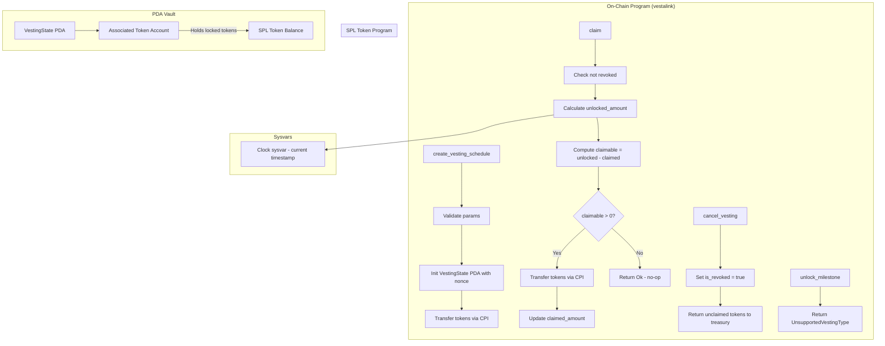

# Design Document

## Overview

This design covers the **vesting-contract** feature for VestaLink — implementing the core on-chain business logic for linear vesting streams on Solana. The scaffold phase established the Anchor project structure with empty instruction handlers and account definitions. This phase fills in the real logic: token transfers via CPI, linear unlock calculations, claim mechanics, authorization enforcement, and error handling.

The scope is limited to **Linear vesting** (tokens unlock continuously over time). The `VestingType::Cliff` and `VestingType::Milestone` variants remain in the enum but are rejected with `UnsupportedVestingType` when used in `create_vesting_schedule`. The `cancel_vesting` instruction is implemented to set `is_revoked = true` and return unclaimed tokens to the treasury, enabling the revoked-stream error path required by the requirements.

A creator can create **multiple vesting streams** for the same recipient by using different nonces. Each stream is a separate VestingState PDA account with its own independent vesting schedule and token vault.

## Architecture



### Key Design Decisions

1. **Linear-only scope**: `create_vesting_schedule` accepts only `VestingType::Linear`. Cliff and Milestone variants are rejected with `UnsupportedVestingType`. This keeps the implementation focused and testable.

2. **Nonce-based PDA derivation**: Each VestingState PDA is derived from seeds `["vesting", funder, recipient, nonce]` where `nonce` is a `u64` chosen by the creator. This allows multiple independent vesting streams between the same funder and recipient. The nonce is passed as a parameter and stored in the VestingState account.

3. **PDA-owned ATA vault**: The vesting token account is an Associated Token Account owned by the VestingState PDA. The client creates this ATA before calling `create_vesting_schedule`. This follows the standard Anchor pattern and avoids complex CPI account creation inside the handler.

4. **Integer arithmetic with floor**: The unlock calculation uses `total_amount * elapsed / duration` with integer division, which naturally floors the result. This ensures `unlocked_amount` never exceeds the true proportional share, preventing over-claiming.

5. **Clock sysvar for timestamps**: The `claim` handler reads the Solana `Clock` sysvar to get the current slot timestamp. This is the standard on-chain time source and cannot be manipulated by transaction authors.

6. **Zero-claim no-op**: When `unlocked_amount == claimed_amount`, the `claim` instruction succeeds without transferring tokens. This avoids unnecessary CPI calls and transaction failures for recipients who call claim too early.

7. **Revocation returns unclaimed tokens**: `cancel_vesting` sets `is_revoked = true` and transfers `total_amount - claimed_amount` (remaining vault balance) back to the `treasury_return_address`. This ensures no tokens are stranded in revoked streams.

## Components and Interfaces

### Error Codes

```rust
#[error_code]
pub enum VestingError {
    InvalidTimeRange,           // start_time >= end_time
    InvalidAmount,              // total_amount == 0
    UnsupportedVestingType,    // vesting_type != Linear
    UnauthorizedClaimant,      // signer != recipient
    InsufficientUnlockedTokens, // claimable amount is 0 (no new tokens to claim)
    StreamRevoked,             // is_revoked == true
    ArithmeticOverflow,        // checked arithmetic overflow
    InvalidVaultOwner,         // vesting_token_account.owner != vesting_state.key()
}
```

### Instruction: create_vesting_schedule

**Handler Logic:**

```rust
pub fn create_vesting_schedule(
    ctx: Context<CreateVestingSchedule>,
    params: CreateVestingParams,
) -> Result<()> {
    // 1. Validate parameters
    require!(params.total_amount > 0, VestingError::InvalidAmount);
    require!(params.start_time < params.end_time, VestingError::InvalidTimeRange);
    require!(params.vesting_type == VestingType::Linear, VestingError::UnsupportedVestingType);

    // 2. Initialize VestingState account (Anchor handles PDA init via #[account(init)])
    let vesting_state = &mut ctx.accounts.vesting_state;
    vesting_state.recipient = ctx.accounts.recipient.key();
    vesting_state.funder = ctx.accounts.funder.key();
    vesting_state.total_amount = params.total_amount;
    vesting_state.claimed_amount = 0;
    vesting_state.authority_revoker = ctx.accounts.funder.key(); // creator is default revoker
    vesting_state.authority_milestone = ctx.accounts.funder.key(); // creator is default milestone authority
    vesting_state.treasury_return_address = ctx.accounts.funder_token_account.key();
    vesting_state.vesting_type = params.vesting_type;
    vesting_state.is_revoked = false;
    vesting_state.start_time = params.start_time;
    vesting_state.end_time = params.end_time;
    vesting_state.cliff_time = params.start_time; // Linear: no cliff, set to start_time
    vesting_state.milestone_count = 0;
    vesting_state.milestones_reached = 0;
    vesting_state.nonce = params.nonce;

    // 3. Transfer tokens from funder to PDA vault via CPI
    let transfer_amount = params.total_amount;
    let cpi_accounts = Transfer {
        from: ctx.accounts.funder_token_account.to_account_info(),
        to: ctx.accounts.vesting_token_account.to_account_info(),
        authority: ctx.accounts.funder.to_account_info(),
    };
    token::transfer(cpi_accounts, transfer_amount)?;

    Ok(())
}
```

**Account Constraints (CreateVestingSchedule):**

```rust
#[derive(Accounts)]
pub struct CreateVestingSchedule<'info> {
    #[account(
        init,
        payer = funder,
        space = VestingState::SIZE,
        seeds = [
            "vesting".as_ref(),
            funder.key().as_ref(),
            recipient.key().as_ref(),
            &params.nonce.to_le_bytes()
        ],
        bump
    )]
    pub vesting_state: Account<'info, VestingState>,

    #[account(mut)]
    pub funder: Signer<'info>,

    /// CHECK: Recipient address used as PDA seed; validation happens in handler logic.
    pub recipient: UncheckedAccount<'info>,

    pub funder_token_account: Account<'info, TokenAccount>,

    #[account(
        mut,
        constraint = vesting_token_account.owner == vesting_state.key() @ VestingError::InvalidVaultOwner
    )]
    pub vesting_token_account: Account<'info, TokenAccount>,

    pub token_program: Program<'info, Token>,
    pub system_program: Program<'info, System>,
}
```

Note: The `params.nonce` is used in the PDA seeds, enabling multiple streams per funder-recipient pair. Each unique nonce produces a unique PDA address.

### Instruction: claim

**Handler Logic:**

```rust
pub fn claim(ctx: Context<Claim>) -> Result<()> {
    let vesting_state = &mut ctx.accounts.vesting_state;

    // 1. Check stream is not revoked
    require!(!vesting_state.is_revoked, VestingError::StreamRevoked);

    // 2. Calculate unlocked amount using Clock sysvar
    let current_time = Clock::get()?.unix_timestamp;
    let unlocked_amount = calculate_unlocked(
        vesting_state.total_amount,
        vesting_state.start_time,
        vesting_state.end_time,
        current_time,
    );

    // 3. Compute claimable amount
    let claimable_amount = unlocked_amount
        .checked_sub(vesting_state.claimed_amount)
        .ok_or(VestingError::InsufficientUnlockedTokens)?;

    // 4. If claimable is 0, succeed as no-op
    if claimable_amount == 0 {
        return Ok(());
    }

    // 5. Transfer tokens from PDA vault to recipient via CPI (PDA signs)
    let seeds = &[
        "vesting".as_bytes(),
        vesting_state.funder.as_ref(),
        vesting_state.recipient.as_ref(),
        &vesting_state.nonce.to_le_bytes(),
        &[vesting_state.bump],
    ];
    let signer_seeds = &[&seeds[..]];
    
    let cpi_accounts = Transfer {
        from: ctx.accounts.vesting_token_account.to_account_info(),
        to: ctx.accounts.recipient_token_account.to_account_info(),
        authority: ctx.accounts.vesting_state.to_account_info(),
    };
    token::transfer(cpi_accounts.with_signer(signer_seeds), claimable_amount)?;

    // 6. Update claimed_amount
    vesting_state.claimed_amount = vesting_state.claimed_amount
        .checked_add(claimable_amount)
        .ok_or(VestingError::ArithmeticOverflow)?;

    Ok(())
}
```

**Bump Storage**: The VestingState account stores its PDA bump to sign CPIs. A `bump: u8` field is added to `VestingState`.

**Account Constraints (Claim):**

```rust
#[derive(Accounts)]
pub struct Claim<'info> {
    #[account(
        mut,
        has_one = recipient,
        constraint = !vesting_state.is_revoked @ VestingError::StreamRevoked
    )]
    pub vesting_state: Account<'info, VestingState>,

    pub recipient: Signer<'info>,

    #[account(
        constraint = recipient_token_account.owner == recipient.key()
    )]
    pub recipient_token_account: Account<'info, TokenAccount>,

    #[account(mut)]
    pub vesting_token_account: Account<'info, TokenAccount>,

    pub token_program: Program<'info, Token>,
}
```

The `has_one = recipient` constraint ensures only the designated recipient can claim. The `constraint = !vesting_state.is_revoked` provides a second layer of revocation checking at the account validation level.

### Instruction: cancel_vesting

**Handler Logic:**

```rust
pub fn cancel_vesting(ctx: Context<CancelVesting>) -> Result<()> {
    let vesting_state = &mut ctx.accounts.vesting_state;

    // 1. Mark as revoked
    vesting_state.is_revoked = true;

    // 2. Calculate remaining unclaimed tokens
    let remaining_amount = vesting_state.total_amount
        .checked_sub(vesting_state.claimed_amount)
        .ok_or(VestingError::ArithmeticOverflow)?;

    // 3. Transfer remaining tokens back to treasury via CPI (PDA signs)
    if remaining_amount > 0 {
        let seeds = &[
            "vesting".as_bytes(),
            vesting_state.funder.as_ref(),
            vesting_state.recipient.as_ref(),
            &vesting_state.nonce.to_le_bytes(),
            &[vesting_state.bump],
        ];
        let signer_seeds = &[&seeds[..]];

        let cpi_accounts = Transfer {
            from: ctx.accounts.vesting_token_account.to_account_info(),
            to: ctx.accounts.treasury_return_address.to_account_info(),
            authority: ctx.accounts.vesting_state.to_account_info(),
        };
        token::transfer(cpi_accounts.with_signer(signer_seeds), remaining_amount)?;
    }

    Ok(())
}
```

### Instruction: unlock_milestone

**Handler Logic:**

```rust
pub fn unlock_milestone(_ctx: Context<UnlockMilestone>) -> Result<()> {
    // Milestone vesting is not supported in this phase
    err!(VestingError::UnsupportedVestingType)
}
```

### Helper: calculate_unlocked

```rust
/// Calculates the unlocked token amount using linear vesting formula.
/// Uses integer arithmetic with floor division to ensure
/// unlocked_amount never exceeds the true proportional share.
pub fn calculate_unlocked(total_amount: u64, start_time: i64, end_time: i64, current_time: i64) -> u64 {
    if current_time <= start_time {
        return 0;
    }
    if current_time >= end_time {
        return total_amount;
    }
    let elapsed = (current_time - start_time) as u128;
    let duration = (end_time - start_time) as u128;
    let total = total_amount as u128;
    // total * elapsed / duration — u128 prevents overflow for reasonable values
    ((total * elapsed) / duration) as u64
}
```

**Overflow protection**: The calculation casts to `u128` before multiplying `total_amount * elapsed`, preventing overflow for any realistic token amount. The result is cast back to `u64` after division, which is safe because `total * elapsed / duration <= total_amount`.

## Data Models

### VestingState (Updated)

The existing `VestingState` account struct gains two new fields: `bump: u8` for PDA signing and `nonce: u64` for multi-stream support.

```rust
#[account]
pub struct VestingState {
    pub recipient: Pubkey,           // 32 bytes
    pub funder: Pubkey,              // 32 bytes
    pub total_amount: u64,           // 8 bytes
    pub claimed_amount: u64,         // 8 bytes
    pub authority_revoker: Pubkey,   // 32 bytes
    pub authority_milestone: Pubkey, // 32 bytes
    pub treasury_return_address: Pubkey, // 32 bytes
    pub vesting_type: VestingType,   // 1 byte (enum max variant)
    pub is_revoked: bool,            // 1 byte
    pub start_time: i64,             // 8 bytes
    pub end_time: i64,               // 8 bytes
    pub cliff_time: i64,             // 8 bytes
    pub milestone_count: u8,         // 1 byte
    pub milestones_reached: u8,     // 1 byte
    pub bump: u8,                    // 1 byte
    pub nonce: u64,                  // 8 bytes — NEW (multi-stream differentiator)
}
```

**Updated SIZE calculation**: 8 (discriminator) + 32×5 (Pubkeys) + 8×2 (u64s) + 1 (VestingType) + 1 (bool) + 8×3 (i64s) + 1×3 (u8s) + 1 (bump) + 8 (nonce) = 8 + 160 + 16 + 1 + 1 + 24 + 3 + 1 + 8 = **222 bytes**. Anchor rounds to 8-byte alignment → **224 bytes**.

### VestingType Enum (Unchanged)

```rust
#[derive(AnchorSerialize, AnchorDeserialize, Clone, PartialEq, Eq, Debug)]
pub enum VestingType {
    Cliff,
    Linear,
    Milestone,
}
```

### CreateVestingParams (Updated)

```rust
#[derive(AnchorSerialize, AnchorDeserialize, Clone, Debug)]
pub struct CreateVestingParams {
    pub total_amount: u64,
    pub vesting_type: VestingType,
    pub start_time: i64,
    pub end_time: i64,
    pub cliff_time: i64,
    pub milestone_count: u8,
    pub nonce: u64,                  // NEW: differentiator for multiple streams per funder-recipient pair
}
```

### VestingError Enum (New)

```rust
#[error_code]
pub enum VestingError {
    InvalidTimeRange,           // 6000
    InvalidAmount,              // 6001
    UnsupportedVestingType,     // 6002
    UnauthorizedClaimant,       // 6003 (handled by has_one constraint)
    InsufficientUnlockedTokens, // 6004
    StreamRevoked,              // 6005
    ArithmeticOverflow,         // 6006
    InvalidVaultOwner,          // 6007
}
```

Anchor assigns error codes starting at 6000 by default, incrementing by 1 for each variant.

### PDA Seeds

The VestingState PDA is derived from seeds `["vesting", funder, recipient, nonce]` where `nonce` is a `u64` chosen by the creator. This ensures:
- Each funder-recipient-nonce combination produces a unique PDA address
- Multiple vesting streams can exist for the same funder-recipient pair by using different nonces
- The PDA can sign for CPI calls using the stored bump seed
- The nonce is stored in the VestingState account for use in CPI signing seeds

## Correctness Properties

_A property is a characteristic or behavior that should hold true across all valid executions of a system — essentially, a formal statement about what the system should do. Properties serve as the bridge between human-readable specifications and machine-verifiable correctness guarantees._

Property 1: Create stream state correctness
*For any* valid creation of a vesting stream, the resulting VestingState account SHALL store all provided parameters correctly, set `claimed_amount` to 0, set `is_revoked` to false, and the PDA vault SHALL be owned by the VestingState PDA
**Validates: Requirements 1.1, 1.3, 3.1**

Property 2: Token conservation on create
*For any* successful `create_vesting_schedule` invocation, the funder's token balance SHALL decrease by exactly `total_amount` and the PDA vault balance SHALL increase by exactly `total_amount`
**Validates: Requirements 1.2**

Property 3: Invalid parameter rejection
*For any* invocation of `create_vesting_schedule` with invalid parameters (zero `total_amount`, `start_time >= end_time`, or `vesting_type != Linear`), the transaction SHALL be rejected with the corresponding error code
**Validates: Requirements 1.4, 1.5, 1.6, 1.7**

Property 4: Multiple streams per recipient
*For any* funder-recipient pair, creating multiple vesting streams with different nonces SHALL produce independent VestingState PDA accounts, each with its own schedule and token vault
**Validates: Requirements 2.1, 2.2**

Property 5: Linear unlock calculation correctness
*For any* `total_amount`, `start_time`, `end_time`, and `current_time`, the `calculate_unlocked` function SHALL return 0 when `current_time <= start_time`, return `total_amount` when `current_time >= end_time`, and return `total_amount × elapsed / duration` (with floor truncation) when `start_time < current_time < end_time`, where the result never exceeds the true proportional share
**Validates: Requirements 4.1, 4.2, 4.3, 4.5**

Property 6: Claim amount correctness
*For any* claim on an active vesting stream, the amount transferred SHALL equal `unlocked_amount - claimed_amount`, and after the transfer, `claimed_amount` SHALL be updated to reflect the cumulative total claimed
**Validates: Requirements 5.1, 5.2, 6.1**

Property 7: Zero-claim no-op
*For any* claim where `unlocked_amount == claimed_amount`, the instruction SHALL succeed without transferring any tokens and without modifying any account state
**Validates: Requirements 5.3**

Property 8: Unauthorized claim rejection
*For any* attempt to call `claim` by a wallet that is not the designated recipient, the transaction SHALL be rejected with error `UnauthorizedClaimant` and no tokens SHALL be transferred
**Validates: Requirements 7.1, 7.2**

Property 9: Revoked stream claim rejection
*For any* attempt to call `claim` on a vesting stream where `is_revoked == true`, the transaction SHALL be rejected with error `StreamRevoked`
**Validates: Requirements 9.1, 9.2**

## Error Handling

### Custom Error Codes

The VestingContract defines the following custom error codes via Anchor's `#[error_code]` macro:

| Error Code | Anchor Index | Trigger | Description |
|---|---|---|---|
| `InvalidTimeRange` | 6000 | `create_vesting_schedule` | `start_time >= end_time` |
| `InvalidAmount` | 6001 | `create_vesting_schedule` | `total_amount == 0` |
| `UnsupportedVestingType` | 6002 | `create_vesting_schedule`, `unlock_milestone` | `vesting_type != Linear` or milestone unlock on Linear stream |
| `UnauthorizedClaimant` | 6003 | `claim` | Signer is not the designated recipient (Anchor's `has_one` constraint) |
| `InsufficientUnlockedTokens` | 6004 | `claim` | `claimed_amount > unlocked_amount` (invariant violation) |
| `StreamRevoked` | 6005 | `claim` | Stream has been revoked (`is_revoked == true`) |
| `ArithmeticOverflow` | 6006 | `claim`, `cancel_vesting` | Checked arithmetic overflow in `claimed_amount + claimable_amount` or `total_amount - claimed_amount` |
| `InvalidVaultOwner` | 6007 | `create_vesting_schedule` | `vesting_token_account.owner != vesting_state.key()` |

### Error Handling Strategy

1. **Parameter validation first**: All `require!` checks run before any state mutations. If any check fails, the transaction reverts with no side effects.

2. **Anchor constraint errors**: Account validation errors (wrong owner, wrong signer) are handled by Anchor's `#[derive(Accounts)]` constraints and return Anchor's standard error codes. Custom error codes are used for business logic violations.

3. **Checked arithmetic**: All arithmetic operations use `checked_add`, `checked_sub`, etc. to prevent silent overflow. Overflow returns `ArithmeticOverflow` error.

4. **CPI errors**: SPL Token transfer errors propagate naturally. If the funder has insufficient balance, the SPL Token Program returns its own error code. If the vault has insufficient balance for a claim, the SPL Token Program returns an error.

5. **No-claim no-op**: When `claimable_amount == 0`, the instruction succeeds without transferring tokens. This avoids unnecessary CPI calls and prevents transaction failures for recipients who call claim before any tokens unlock.

## Testing Strategy

### Unit Tests

Unit tests are written in TypeScript using Anchor's test framework with Mocha/Chai. Tests run against a local Solana validator (`anchor test`).

**Test categories:**

1. **Create stream tests**: Verify VestingState account fields, token transfers, and initial state
2. **Multiple stream tests**: Verify creating multiple streams for the same funder-recipient pair with different nonces
3. **Unlock calculation tests**: Verify `calculate_unlocked` at 0%, 25%, 50%, and 100% elapsed time
4. **Claim tests**: Verify partial claims, full claims, and zero-claim no-ops
5. **Error tests**: Verify all custom error codes are returned for invalid inputs
6. **Authorization tests**: Verify non-recipients cannot claim

**Time manipulation**: Tests use `solana-bankrun` or Anchor's `Clock` sysvar override to advance time and test unlock calculations at specific points in the vesting period.

### Property-Based Tests

Property tests validate universal correctness properties across many generated inputs. Each property test runs a minimum of 100 iterations.

| Property | Test Approach |
|---|---|
| Property 1: Create stream state correctness | Generate random valid parameters, create stream, verify all VestingState fields match inputs and initial values |
| Property 2: Token conservation on create | Generate random valid amounts, create stream, verify funder balance decreased and vault balance increased by exactly `total_amount` |
| Property 3: Invalid parameter rejection | Generate invalid parameters (zero amount, reversed times, non-Linear types), verify each returns the correct error |
| Property 4: Multiple streams per recipient | Create multiple streams for the same funder-recipient pair with different nonces, verify each is independent with its own PDA and schedule |
| Property 5: Linear unlock calculation correctness | Generate random `total_amount`, `start_time`, `end_time`, and `current_time` values, verify `calculate_unlocked` returns the correct result with floor truncation |
| Property 6: Claim amount correctness | Create stream, advance time, claim, verify transfer amount and `claimed_amount` update |
| Property 7: Zero-claim no-op | Create stream, claim before any tokens unlock, verify no token transfer and no state change |
| Property 8: Unauthorized claim rejection | Create stream, attempt claim with non-recipient wallet, verify `UnauthorizedClaimant` error |
| Property 9: Revoked stream claim rejection | Create stream, cancel vesting, attempt claim, verify `StreamRevoked` error |

Each property test is tagged: **Feature: vesting-contract, Property N: [title]**

### Test Configuration

- Minimum 100 iterations per property test
- Local validator via `anchor test`
- Time manipulation via Clock sysvar override
- SPL Token mint and ATAs created in test setup